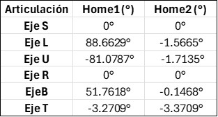

<table>
  <tr>
    <td>
      <h1>Laboratorio No. 02 - Robótica Industrial</h1>
      <h2> Análisis y Operación del Manipulador Motoman MH6 </h2>
      <h3> Comparativa y Aplicaciones Prácticas </h3>
      <strong> Autores:</strong>
      <ul>
        <li>Daniel Mauricio Rivero Lozada </li>
        <li>Yeira Liseth Rodríguez Rodríguez</li>
      </ul>
    </td>
    <td>
      
    </td>
  </tr>
</table>

## Comparación Motoman MH6 y IRB ABB 140.

El Motoman MH6 es un robot versátil con un amplio alcance y alta velocidad, ideal para tareas como soldadura, manipulación de materiales y recubrimiento. Por otro lado, el ABB IRB 140 es un robot compacto con alta precisión y repetibilidad, adecuado para aplicaciones de ensamblaje, carga y descarga de máquinas y pulido.

  

Por otro lado, también hay un cambio en el espacio de trabajo de ambos robots

### Motoman MH6.

  

### ABB IRB 140

  

La información anteriormente mostrada fue extraida de :
* https://www.yaskawa.fr/yaskawa.fr/Robots%20d%27occasion/Brochures/Flyer_Robot_MH6-10_E_06.2014.pdf
* https://library.e.abb.com/public/a7121292272d40a9992a50745fdaa3b2/3HAC041346%20PS%20IRB%20140-en.pdf

## Posiciones Home1 y Home2 del Motoman MH6.

Las configuraciones de Home1 y Home2 son posiciones de inicio con ligeras variaciones. En el primero se dispone del robot completamente extendido, es decir, los ángulos de sus articulaciones son todas cero. Por otro lado, para home2 se encuentra un cambio en las articulaciones 2 y 3 con ángulos de 45° y -45° respectivamente. Esto permite una posición más compacta del robot. 

  

La posición dependerá de la situación, en general se prefiere la segunda por la reducción del espacio ocupado y los riesgos de colisión. La primera posición es más usada para casos de mantenimiento, es decir, es útil calibraciones y diagnósticos iniciales.

## Procedimiento movimientos manuales

Los movimientos manuales en el Motoman MH6 se realizar de modo articular (moviendo cada articulación individualmente) o en modo cartesiano (trasladando o rotando el efector final en un sistema de coordenadas XYZ).

  

El procedimiento es el siguiente

<ul>
  <li>Después de que el robot está encendido, segurarse de que está en modo manual ( Teach Mode) </li>
  <li>Girar la llave de habilitación en el Teach Pendant a la posición "Teach" </li>
  <li>Presionar el botón "Enable" en el Teach Pendant</li>
  <li>Presionar botón "Coordinate" y seleccionar el modo deseado (Joint - JNT o Cartesian - XYZ)</li>
  <li>Dependiendo del modo seleccionado seleccionar los botones para el movimiento deseado: para movimiento articular ±S, ±L, ±U, ±R, ±B, ±T, y para movimiento cartesiano ±X, ±Y, ±Z, (traslación) ±RX, ±RY, ±RZ (movimiento) </li>
  <li>Mantener presionado "Enable" y mover en la dirección deseada hasta alcanzar la posición requerida.</li>
</ul>

  

## Principales Funcionalidades de RoboDK

El software RoboDK en cuanto a sus funcionalidades cuenta con una librería de gran cantidad de modelos de brazos robóticos y manipuladores de los principales fabricantes conocidos a nivel mundial. Estos robots se pueden seleccionar según parámetros técnicos como capacidad de carga, alcance, grados de libertad, precisión y dimensiones físicas. Además, incluye componentes preconfigurados para otras aplicaciones en el campo de la robótica, como cintas transportadoras, herramientas especializadas, cámaras, estructuras de seguridad y soportes, disponibles para su integración inmediata en entornos virtuales.  

Otra funcionalidad permite la importación de diseños 3D más personalizados mediante archivos CAD, facilitando la adaptación de simulaciones a requisitos específicos de herramientas, piezas o entornos de trabajo. La interfaz de RoboDK permite la programación mediante una secuenciación visual de movimientos (lineales, articulares, circulares), gestión de tiempos de espera y activación de señales digitales, de manera que es posible generar y simular rutinas complejas sin necesidad de código avanzado.  

Para aplicaciones más especializadas, se cuenta con una API para programación en Python, que permite desarrollar scripts para detalles más precisos, automatizar tareas o implementar lógicas operativas avanzadas. Adicionalmente, la programación fuera de línea posibilita la validación virtual de los manipuladores robóticos, incluyendo análisis de colisiones, optimización de trayectorias y ajuste de parámetros, antes de su implementación física. Además de esto, se tienen los post-procesadores integrados que garantizan la conversión automática de programas a lenguajes nativos de robots industriales (KUKA, ABB, Fanuc, entre otros), además de generar código compatible con Python, C++, C# y MATLAB.  

Otra característica es que a la hora de realizar la simulación en tiempo real es posible probar y validar programas creados bajo condiciones virtuales, esto permite comprobar la precisión, seguridad y eficiencia operativa. A su vez, la plataforma puede integrar un apartado para conectar sensores, sistemas de visión artificial y dispositivos de adquisición de datos, para poder representar escenarios operativos más realistas. Finalmente, RoboDK es compatible con sistemas Windows, Linux y macOS, esto permite su adaptabilidad en entornos multidisciplinarios.

### Conexión de RoboDK con el manipulador

Para realizar la conexión con el robot, se debe acceder en la barra de herramientas a la opción "Conectar" y posteriormente dar click a "Conectar con el robot" tal como se evidencia en la siguiente imagen:

  

Posteriormente se abrirá una ventanta como la siguiente:

  

En esta ventanta se debe asignar la direccion IP del robot y el puerto de conexión y posteriormente realizar un ping para comprobar si es posible realizar la conexión. Posteriormente se debe dar click en conectar para establecer la conexión con el robot. De esta manera se debe observar algo como la imagen que aparece a continuación:

  

Finalmente, para ejecutar el programa en el robot se debe hacer click derecho sobre el archivo del script y selecciónar la opción "Ejecutar en el robot":

  

## Anlálisis Comparativo entre RoboDK y Robot Studio

<table>
  <tr>
    <th>Característica</th>
    <th>Robot Studio</th>
    <th>RoboDK</th>
  </tr>
  <tr>
    <td rowspan="4">Diferencias</td>
    <td>Está diseñado exclusivamente para robots ABB, en donde se integran a profundidad los controladores y funcionalidades específicas de ABB</td>
    <td>Soporta más de 50 marcas de robots, incluyendo modelos personalizados. Su enfoque es multi-marca y flexible</td>
  </tr>
  <tr>
    <td>Utiliza RAPID</td>
    <td>Basado en Python y ofrece una API para personalización</td>
  </tr>
  <tr>
    <td>Proporciona simulación de alta fidelidad para ABB, permite replicar movimientos reales con precisión en velocidad, aceleración y tiempos de ciclo</td>
    <td>Ofrece simulación funcional para múltiples marcas, pero con limitaciones en precisión para movimientos complejos. Por otra parte, incluye módulos como RRS para mejorar la simulación específica de ABB</td>
  </tr>
  <tr>
    <td>Interfaz gráfica potente pero compleja, orientada a usuarios avanzados familiarizados con ABB</td>
    <td>Interfaz intuitiva y gráfica. Permite programar robots arrastrando objetivos en 3D o importando archivos G-code, optimizando trayectorias automáticamente para evitar singularidades</td>
  </tr>
  <tr>
    <td rowspan="4">Usos</td>
    <td>Programación avanzada de robots ABB</td>
    <td>Programación fuera de línea para múltiples marcas de robots</td>
  </tr>
  <tr>
    <td>Simulación detallada para optimizar tiempos de ciclo en entornos industriales ABB</td>
    <td>Aplicaciones con conversión de G-code</td>
  </tr>
  <tr>
    <td>Formación técnica especializada en ABB</td>
    <td>Prototipado rápido y proyectos educativos con soporte para Python</td>
  </tr>
</table>

Si bien RoboDK es excelente para la planificación de trayectorias y simulaciones básicas, no sustituye por completo a RobotStudio cuando se requieren todas las características y las propiedades específicas del entorno ABB, especialmente en aplicaciones que dependen de funciones avanzadas propias de ABB. Por otro lado, la versatilidad de RoboDK permiten que sea una opción muy adecuada para ciertos ámbitos que no dependen exclusivamente de robots ABB.

